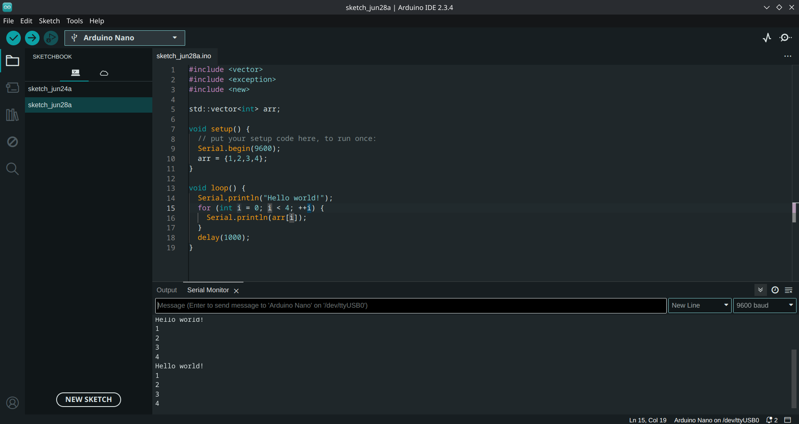

# stdarduino

A version of Arduino AVR with a standard library.

Install by adding [https://raw.githubusercontent.com/DolphinGui/stdarduino/refs/heads/main/package_dolphingui_index.json]
to the board manager. Supports up to C++20. Somewhat untested.

## Example
Tested on an Arduino Nano. 
```cpp
#include <vector>

std::vector<int> list;

void setup() {
  // put your setup code here, to run once:
  Serial.begin(9600);
  list = {1,2,3,4,5};
}

void loop() {
  // put your main code here, to run repeatedly:
  Serial.println("Hello world!");
  for(int i = 0; i < 5; ++i){
    Serial.println(list.at(i));
  }
  delay(1000);
}
```

Screenshot:

